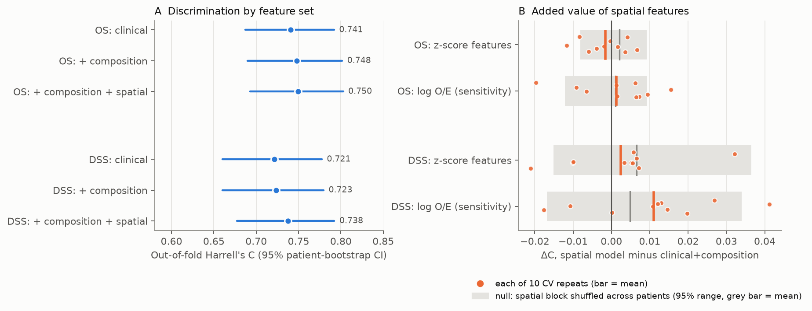
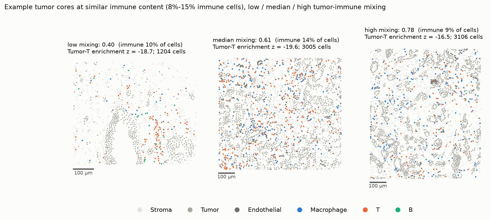
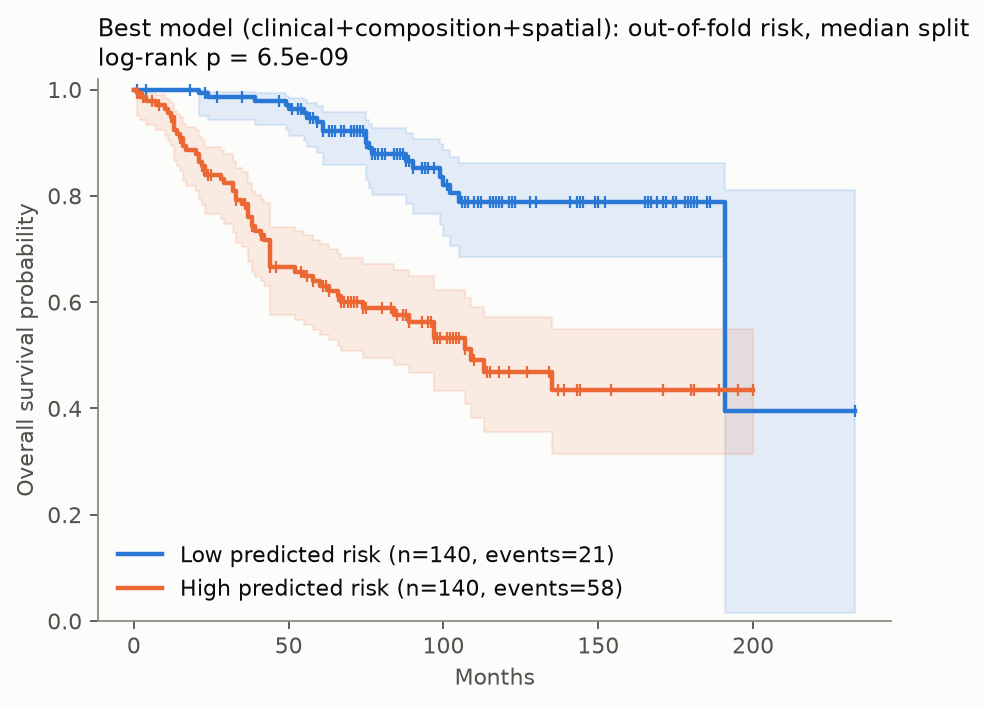
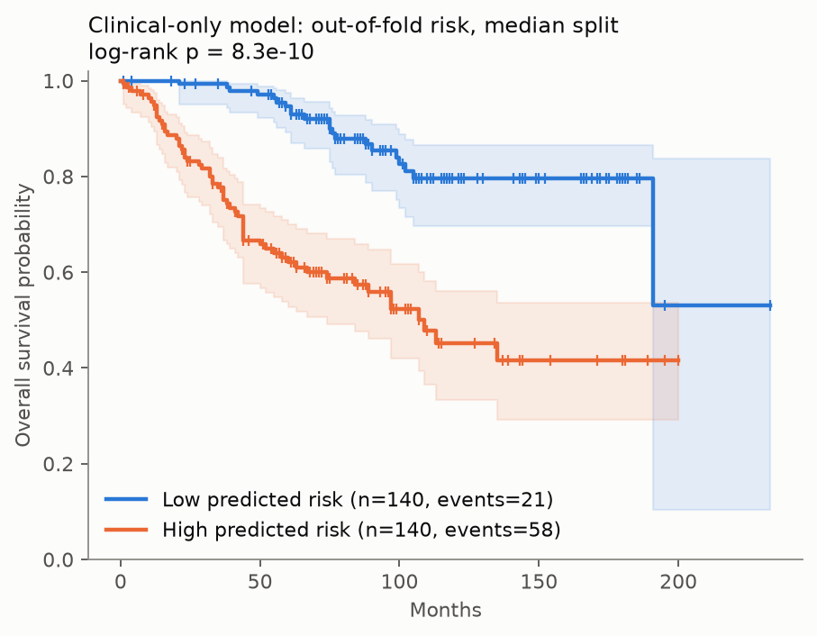
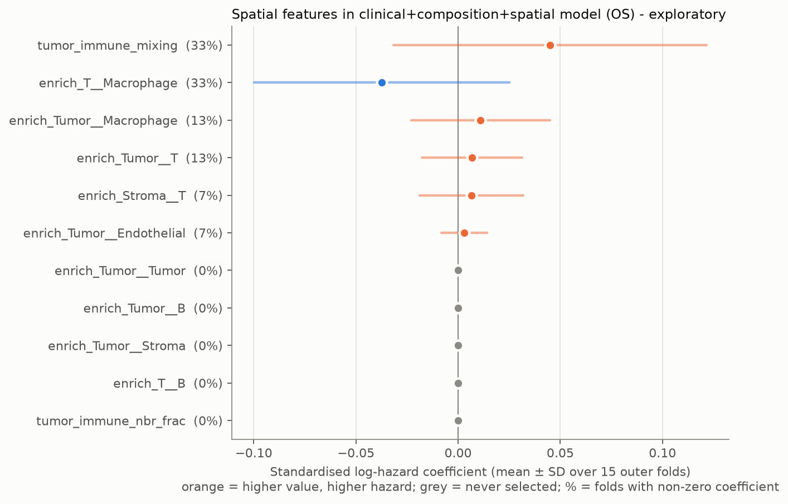
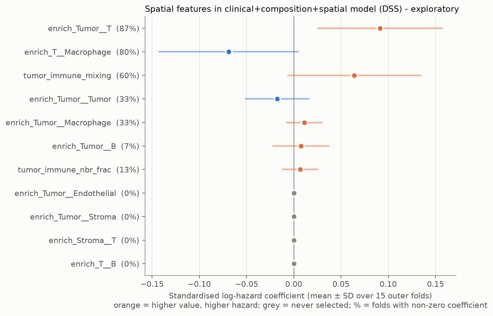
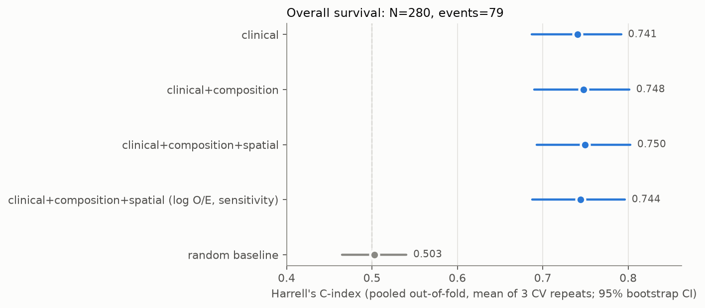
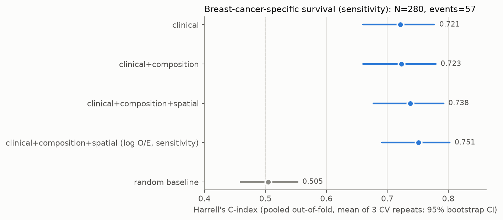

# Do spatial tumor-microenvironment features add prognostic value in breast cancer?

A methods note on the Jackson et al. 2020 (*Nature*) imaging mass cytometry (IMC) breast cancer cohort. The analysis asks whether per-patient cell-type composition, and then spatial-interaction features, improve out-of-fold survival prediction **beyond standard clinical variables**. CPU only; the full pipeline reruns in a few minutes from one command.



**Findings**

1. **No detectable added value on the primary endpoint (overall survival, N = 280, 79 deaths).** Clinical variables alone give C = 0.741. Adding composition and spatial features reaches 0.750.
   - The spatial-over-composition gain is +0.002 (95% CI −0.005 to +0.008).
   - Across 10 different CV partitions it averages −0.002.
   - It sits inside the null obtained by shuffling the spatial features across patients (permutation p = 0.667).
   - The cohort could have detected a gain of roughly 0.010–0.014 C (§5.4), so any real gain is likely smaller than that.
2. **Breast-cancer-specific survival (secondary) shows a weak, unstable hint, not a result.** One post-hoc, size-robust variant of the spatial features gains +0.011 ± 0.017 across 10 CV repeats, with permutation p = 0.048. This does not survive the multiplicity of comparisons examined. It is a hypothesis for an external cohort.
3. **Two popular "spatial" summaries are mostly composition in disguise.** Across images, the tumor–immune mixing score has Spearman ρ = −0.89 with immune-cell fraction, and the immune fraction among tumor cells' neighbours has ρ = +0.92. Permutation z-scores also track image size (|ρ| up to 0.55). Spatial features need to be checked against composition and size before they can be credited with independent information (§5.5).
4. **The prognostic signal is clinical.** The Kaplan–Meier split of the best model (log-rank p = 6.5e-09) is matched by the clinical-only model (p = 8.3e-10), and the two put 94% of patients in the same risk half.

**What guards the result:**
- Nested CV, split by patient.
- Tests that spy on every model fit and fail if any fit sees a held-out patient.
- A shared patient bootstrap for paired model comparisons.
- 10 CV repeats and a permutation null, because the bootstrap alone ignores CV-partition variability.
- A test that every table row in this README is reproduced verbatim by the analysis code from saved results.

All deviations from the original plan are listed in §7.

---

## 1. Question and relation to prior work

On a single cohort, does each added layer improve out-of-fold discrimination (Harrell's C) of overall survival? The layers are clinical → + cell-type composition → + spatial interactions.

This question is narrower than the claims of the source paper. **Jackson et al. 2020** profiled 35 markers in 720 IMC images from 352 patients, 281 of them with long-term survival data (the Basel cohort used here). They defined 18 single-cell pathology (SCP) subgroups from cell phenotypes and their community organisation, and these subgroups differed in outcome. That is a group-level association discovered on the whole cohort. It does not measure how much out-of-fold discrimination these data add once standard clinical variables are already in the model, which is the question here. A null result here is therefore not in tension with theirs.

The mixing score adapts **Keren et al. 2018** (MIBI-TOF, 41 triple-negative breast cancers), who described "mixed" vs. "compartmentalized" tumor–immune architecture and linked compartmentalization to survival. In this cohort my variant of the score is largely explained by immune content (finding 3), so it should be read alongside composition, not instead of it. **Danenberg et al. 2022** (693 METABRIC tumors) found recurrent multicellular TME structures, including a "suppressed expansion" structure that predicted poor outcome in ER-positive disease. That suggests prognostic spatial information may require richer descriptors and more patients than this pre-specified panel of 11 features on 280 patients.

## 2. Data

**Source.** Zenodo [10.5281/zenodo.4607374](https://doi.org/10.5281/zenodo.4607374); the earlier version, 3518284, holds a subset of the same files. `scripts/download_data.py` lists the record, verifies MD5 checksums, and fetches only:

| File | Size | Contents used |
|---|---|---|
| `singlecell_cluster_labels.zip` | 7.9 MB | `Basel_metaclusters.csv` (cell id → metacluster 1–27), `Metacluster_annotations.csv` |
| `singlecell_locations.zip` | 23.2 MB | `Basel_SC_locations.csv` (cell id, core, `Location_Center_X/Y`) |
| `SingleCell_and_Metadata.zip` (36.8 GB) | **not downloaded** | only `Data_publication/BaselTMA/Basel_PatientMetadata.csv` (0.16 MB), extracted with HTTP range requests (a few MB transferred, CRC-checked) |

**Cohort: Basel only.** Basel has a standalone patient-metadata table with survival. Zurich clinical data exists only inside a 3.7 GB histoCAT MATLAB session, so Zurich is not used.

**Filtering.** 376 cores → 289 tumor cores (`diseasestatus == "tumor"`; normal-tissue cores excluded) → 281 patients → **N = 280** after dropping one patient with `OSmonth = 0`. The final cohort has 288 images and 762,776 labelled cells. 8 patients have two tumor cores, and their clinical fields are identical across cores.

**Endpoints.**
- **Overall survival (OS, primary).** Time = `OSmonth`; event = any death, **79 events**. "alive" and "alive w metastases" are censored. Median follow-up time across all patients is 74 months.
- **Breast-cancer-specific survival (DSS, secondary; agreed before modelling).** Only "death by primary disease" counts, **57 events**; other deaths are censored.

**Patient-level aggregation.** For composition, cells from all of a patient's tumor cores are pooled. Spatial features are computed per image and averaged per patient, weighted by cell count.

## 3. Features



*Example cores: one dot per cell. Tumor (dark grey), stroma (light grey) and endothelium are context; immune classes are coloured. All three cores come from images between the 40th and 60th percentile of immune fraction, so the figure contrasts **arrangement** at similar **amount**.*

**Clinical (7).** Age, tumor size (mm), grade (1–3, ordinal), pN (0–3; "x" → missing), and ER, PR, HER2 (positive = 1). Missing values (pN 13, ER 1, PR 6) are median-imputed inside each training fold. pM and one-hot grade were dropped for numerical reasons (§7). pT was left out as redundant with tumor size, and treatment because it is decided after baseline.

**Composition (27).** Counts of the 27 published metaclusters per patient, CLR-transformed: add a pseudocount of 0.5 cells, close each row, log, and centre each row on its own mean. CLR is row-wise; the standardisation that follows is fit on training folds only.

**Spatial (11), pre-specified.** Per image:
- **Graph.** Undirected kNN graph, k = 8, on cell centroids. IMC pixels are 1 µm. I chose kNN over a 20 µm radius because it adapts to local density and leaves no cell isolated.
- **Coarse classes** (from the metacluster annotations):
  - Tumor (all 14 "Tumor"-class clusters)
  - T (3, 5)
  - B (1 B cell, 2 T & B cells)
  - Macrophage (4, 6)
  - Endothelial (7)
  - Stroma (8–13)
- **Neighbour enrichment, 9 pairs.** Tumor–Tumor, Tumor–T, Tumor–Macrophage, Tumor–B, Tumor–Stroma, Tumor–Endothelial, T–Macrophage, T–B, Stroma–T. The statistic is the undirected edge count between two classes, as a z-score against 200 within-image label permutations (graph fixed, labels shuffled, which preserves composition). It is missing if either class has fewer than 5 cells; missing values are imputed in-fold.
- **`tumor_immune_nbr_frac`.** The mean fraction of immune cells among each tumor cell's 8 neighbours.
- **`tumor_immune_mixing`.** Tumor–immune edges / (tumor–immune + immune–immune edges), a bounded variant of Keren et al.

The enrichment code is unit-tested against a hand-computed exact null and the closed-form permutation mean.

**Sensitivity variant (post hoc, §7).** z-scores grow with the number of edges in an image, so the full model was also fit with **log₂((observed + 1)/(expected + 1))** for the 9 pairs.

## 4. Models and validation

- **Clinical model:** ridge Cox (`CoxPHSurvivalAnalysis`), with α chosen from 20 log-spaced values between 10⁻² and 10³.
- **Models with omics blocks:** elastic-net Cox (`CoxnetSurvivalAnalysis`, l1_ratio 0.5) with clinical columns **unpenalized**, so they nest the clinical model. α is chosen from a 20-point path derived from each outer-training set.
- **Tuning effort is identical:** one penalty, 20 candidates, inner 5-fold CV stratified by event, selected by mean Harrell's C.
- **Baseline:** random Gaussian risk scores, as a sanity check that C ≈ 0.5.
- **Outer CV:** 5-fold stratified by event, repeated with 3 seeds, using the same folds for every model. Rows are patients, so all splits are by patient.
- **Leakage control:** imputation, scaling and the α path are fit inside training folds. A test spies on every fit inside the nested CV and asserts that none sees an outer-test patient.
- **Metric:** Harrell's C on the **pooled** out-of-fold predictions of each CV repeat, averaged over repeats.
- **Uncertainty, three ways:**
  1. A 1,000-resample patient bootstrap shared by all models (paired differences, percentile CIs). It holds the out-of-fold predictions fixed.
  2. 10 CV repeats, which capture partition variability.
  3. A permutation null: shuffle the spatial block across patients and rerun the full nested CV (20 permutations × 3 seeds). This shows how much C a penalised model gains from 11 features that carry no outcome information.

## 5. Results

### 5.1 Overall survival (primary)

| Model | C-index | 95% CI | per CV repeat (seeds 0, 1, 2) |
|---|---|---|---|
| clinical | 0.741 | 0.687 to 0.792 | 0.735, 0.755, 0.733 |
| clinical+composition | 0.748 | 0.690 to 0.801 | 0.740, 0.760, 0.743 |
| clinical+composition+spatial | 0.750 | 0.693 to 0.803 | 0.742, 0.760, 0.747 |
| clinical+composition+spatial (log O/E, sensitivity) | 0.744 | 0.688 to 0.796 | 0.742, 0.740, 0.750 |
| random baseline | 0.503 | 0.465 to 0.540 | 0.564, 0.484, 0.461 |

| Comparison | ΔC | 95% CI | share of bootstrap Δ > 0 |
|---|---|---|---|
| clinical+composition minus clinical | +0.007 | -0.017 to +0.029 | 0.67 |
| clinical+composition+spatial minus clinical+composition | +0.002 | -0.005 to +0.008 | 0.70 |
| clinical+composition+spatial minus clinical | +0.009 | -0.014 to +0.031 | 0.74 |
| clinical+composition+spatial (log O/E, sensitivity) minus clinical+composition | -0.004 | -0.014 to +0.006 | 0.24 |

| Spatial model vs. clinical+composition | ΔC (3 main repeats) | ΔC over 10 CV repeats: mean ± SD [min, max] | repeats with Δ > 0 | permuted-spatial null ΔC: mean ± SD (max) | permutation p |
|---|---|---|---|---|---|
| clinical+composition+spatial | +0.002 | -0.002 ± 0.006 [-0.012, +0.007] | 4/10 | +0.002 ± 0.003 (+0.005) | 0.667 |
| clinical+composition+spatial (log O/E, sensitivity) | -0.004 | +0.001 ± 0.010 [-0.020, +0.016] | 7/10 | +0.001 ± 0.003 (+0.006) | 0.952 |

### 5.2 Breast-cancer-specific survival (secondary)

| Model | C-index | 95% CI | per CV repeat (seeds 0, 1, 2) |
|---|---|---|---|
| clinical | 0.721 | 0.660 to 0.777 | 0.734, 0.737, 0.693 |
| clinical+composition | 0.723 | 0.660 to 0.780 | 0.753, 0.707, 0.710 |
| clinical+composition+spatial | 0.738 | 0.677 to 0.792 | 0.759, 0.739, 0.715 |
| clinical+composition+spatial (log O/E, sensitivity) | 0.751 | 0.691 to 0.803 | 0.768, 0.748, 0.736 |
| random baseline | 0.505 | 0.459 to 0.553 | 0.561, 0.464, 0.489 |

| Comparison | ΔC | 95% CI | share of bootstrap Δ > 0 |
|---|---|---|---|
| clinical+composition minus clinical | +0.002 | -0.038 to +0.040 | 0.54 |
| clinical+composition+spatial minus clinical+composition | +0.014 | +0.000 to +0.031 | 0.97 |
| clinical+composition+spatial minus clinical | +0.017 | -0.021 to +0.052 | 0.81 |
| clinical+composition+spatial (log O/E, sensitivity) minus clinical+composition | +0.028 | +0.008 to +0.050 | 1.00 |

| Spatial model vs. clinical+composition | ΔC (3 main repeats) | ΔC over 10 CV repeats: mean ± SD [min, max] | repeats with Δ > 0 | permuted-spatial null ΔC: mean ± SD (max) | permutation p |
|---|---|---|---|---|---|
| clinical+composition+spatial | +0.014 | +0.002 ± 0.014 [-0.021, +0.032] | 7/10 | +0.007 ± 0.008 (+0.023) | 0.143 |
| clinical+composition+spatial (log O/E, sensitivity) | +0.028 | +0.011 ± 0.017 [-0.018, +0.041] | 8/10 | +0.005 ± 0.008 (+0.016) | 0.048 |

The permutation p is (1 + number of null deltas ≥ observed)/(1 + 20), so its smallest possible value is 0.048. The bootstrap CIs alone would have suggested a DSS gain (lower bounds +0.000 and +0.008). The CV-repeat and permutation analyses show how much of that came from the particular 3 CV partitions: even shuffled spatial features "gain" +0.007 on average for DSS.

### 5.3 Kaplan–Meier (median split of out-of-fold risk)

The best OS model by C-index (`clinical+composition+spatial`) gives log-rank p = 6.5e-09. The clinical-only model gives p = 8.3e-10, and the two put 94% of patients in the same risk half. Risk is the mean out-of-fold rank over the 3 CV repeats.

| Best model | Clinical only |
|:---:|:---:|
|  |  |

### 5.4 How large a gain could this cohort detect?

Approximate detectable ΔC at 80% power and two-sided α = 0.05, computed as 2.80 × the SD of the paired bootstrap difference. The last column also adds CV-repeat variability.

| Endpoint | Comparison | SD of paired bootstrap ΔC | detectable ΔC (80% power) | with CV-repeat variability |
|---|---|---|---|---|
| OS | clinical+composition minus clinical | 0.0120 | 0.034 | n/a |
| OS | clinical+composition+spatial minus clinical+composition | 0.0035 | 0.010 | 0.014 |
| DSS | clinical+composition minus clinical | 0.0200 | 0.056 | n/a |
| DSS | clinical+composition+spatial minus clinical+composition | 0.0079 | 0.022 | 0.032 |

For OS this design would usually have detected a spatial gain of about 0.01–0.014 C. The estimate is +0.002 with an upper CI bound of +0.008, so the data argue against a gain of that size, not merely fail to find one. For composition over clinical, only gains of about 0.03 or more were detectable, so smaller composition effects cannot be excluded.

### 5.5 Are the spatial features measuring something other than composition and image size?

Image-level Spearman correlations (288 images):

| Feature | ρ with log(cells): z-score | ρ with log(cells): log O/E | ρ with immune fraction: z-score | ρ with immune fraction: log O/E |
|---|---|---|---|---|
| `enrich_Tumor__Tumor` | +0.55 | -0.29 | +0.24 | +0.67 |
| `enrich_Tumor__T` | -0.44 | -0.03 | -0.43 | -0.24 |
| `enrich_Tumor__Macrophage` | -0.30 | -0.02 | -0.15 | -0.21 |
| `enrich_Tumor__B` | -0.21 | +0.06 | -0.47 | -0.42 |
| `enrich_Tumor__Stroma` | -0.41 | -0.21 | +0.38 | +0.12 |
| `enrich_Tumor__Endothelial` | -0.51 | -0.10 | +0.22 | -0.06 |
| `enrich_T__Macrophage` | +0.30 | +0.30 | +0.11 | -0.34 |
| `enrich_T__B` | -0.03 | -0.06 | +0.31 | -0.08 |
| `enrich_Stroma__T` | +0.39 | +0.38 | -0.47 | -0.65 |
| `tumor_immune_nbr_frac` | -0.17 | (same feature) | +0.92 | (same feature) |
| `tumor_immune_mixing` | +0.19 | (same feature) | -0.89 | (same feature) |

- **Mixing and neighbour fraction are near-composition proxies.** They are ratios of edge counts, and edge counts scale with how many immune cells there are. When immune cells are sparse, each one mostly touches tumor, so "mixing" is high. When immune cells are dense, they touch each other.
- **The z-scores are size-dependent.** The O/E version removes most of that dependence for tumor-centred pairs, but several O/E features correlate *more* strongly with immune fraction (e.g. Tumor–Tumor +0.67, Stroma–T −0.65).
- **Implication.** No feature in this panel is a clean "arrangement independent of amount" measure. A future panel should be checked against both axes before modelling, e.g. by residualising on composition and size, or by using statistics conditioned on composition.

<details>
<summary><b>5.6 Exploratory: spatial coefficients and model sparsity</b> (click to expand)</summary>

These are standardised log-hazard coefficients of the spatial features in `clinical+composition+spatial`, averaged over the 15 outer-fold fits, with the share of folds in which the elastic net kept each feature. The inputs are correlated and shrunk, so **these are not effect estimates**. For DSS, the most consistently kept feature is Tumor–T enrichment, with a *positive* coefficient (more tumor–T contact than chance goes with higher hazard). Its z-score correlates with both image size (−0.44) and immune fraction (−0.43), so I would not interpret the sign.

OS:

| Spatial feature | mean coef | SD | selected in folds |
|---|---|---|---|
| `tumor_immune_mixing` | +0.045 | 0.077 | 33% |
| `enrich_T__Macrophage` | -0.037 | 0.062 | 33% |
| `enrich_Tumor__Macrophage` | +0.011 | 0.034 | 13% |
| `enrich_Tumor__T` | +0.007 | 0.025 | 13% |
| `enrich_Stroma__T` | +0.007 | 0.025 | 7% |
| `enrich_Tumor__Endothelial` | +0.003 | 0.011 | 7% |
| `enrich_Tumor__Tumor` | +0.000 | 0.000 | 0% |
| `enrich_Tumor__B` | +0.000 | 0.000 | 0% |
| `enrich_Tumor__Stroma` | +0.000 | 0.000 | 0% |
| `enrich_T__B` | +0.000 | 0.000 | 0% |
| `tumor_immune_nbr_frac` | +0.000 | 0.000 | 0% |

DSS:

| Spatial feature | mean coef | SD | selected in folds |
|---|---|---|---|
| `enrich_Tumor__T` | +0.091 | 0.066 | 87% |
| `enrich_T__Macrophage` | -0.069 | 0.074 | 80% |
| `tumor_immune_mixing` | +0.064 | 0.070 | 60% |
| `enrich_Tumor__Tumor` | -0.017 | 0.034 | 33% |
| `enrich_Tumor__Macrophage` | +0.011 | 0.019 | 33% |
| `enrich_Tumor__B` | +0.008 | 0.030 | 7% |
| `tumor_immune_nbr_frac` | +0.007 | 0.019 | 13% |
| `enrich_Tumor__Endothelial` | +0.000 | 0.000 | 0% |
| `enrich_Tumor__Stroma` | +0.000 | 0.000 | 0% |
| `enrich_Stroma__T` | +0.000 | 0.000 | 0% |
| `enrich_T__B` | +0.000 | 0.000 | 0% |

Penalty choice and sparsity across the 15 outer folds:

| Endpoint | Model | selected penalty α: median [min, max] | non-zero omics coefs: median [min, max] |
|---|---|---|---|
| OS | clinical | 88.6 [0.379, 1e+03] | 0 [0, 0] |
| OS | clinical+composition | 0.104 [0.0247, 0.146] | 1 [0, 15] |
| OS | clinical+composition+spatial | 0.128 [0.034, 0.183] | 1 [0, 19] |
| OS | clinical+composition+spatial (log O/E, sensitivity) | 0.102 [0.0262, 0.196] | 3 [0, 22] |
| DSS | clinical | 88.6 [0.0616, 1e+03] | 0 [0, 0] |
| DSS | clinical+composition | 0.0532 [0.00914, 0.12] | 8 [0, 21] |
| DSS | clinical+composition+spatial | 0.0566 [0.0256, 0.155] | 10 [0, 20] |
| DSS | clinical+composition+spatial (log O/E, sensitivity) | 0.0511 [0.0256, 0.146] | 11 [0, 21] |






</details>

## 6. Interpretation

- **The clinical model is hard to beat.** Age, size, grade, nodes and receptor status give C ≈ 0.74. Adding 27 composition features and 11 spatial features does not measurably improve on it for OS, and the elastic net usually keeps only about one omics feature (median) when predicting OS.
- **This does not show that spatial organisation is irrelevant to breast cancer outcome.** It shows that *this* panel, on single small cores from 280 patients, carries no detectable *incremental, out-of-fold* information about OS beyond clinical variables. It also shows that two of its most intuitive features largely re-measure composition.
- **The DSS hint is worth one pre-registered test elsewhere, not a claim.** Spatial organisation could plausibly matter more for cancer-specific death than for all-cause death, which includes 22 non-cancer deaths here. But the signal is unstable across CV partitions and comes from a post-hoc variant.

## 7. Deviations from the original plan

1. **Grade is ordinal, not one-hot, and pM is not modelled.** Grade 1 has only 2 disease-specific deaths in 38 patients, and only 7/280 patients are M1. In some CV training folds this produced quasi-separation, and the unpenalized clinical coefficients diverged (Coxnet raised numerical errors). The change was made because of fit failures, not C-index values. A first OS run with the original encoding did finish before the DSS failure. It was not saved, so no numbers from it are reported. It showed the same pattern of small, CI-spanning gains.
2. **Added after seeing first results:** the log O/E spatial variant, the 10 CV repeats, the permutation null, the detectable-effect calculation, and the composition/size confound check. They are robustness and sensitivity analyses and do not redefine the primary model. They were added because the first DSS result looked too good to trust.
3. **DSS** was agreed as a secondary endpoint before modelling.

## 8. Reproduction

```bash
uv sync                                   # Python 3.12, pinned dependencies (pyproject.toml + uv.lock)
uv run python scripts/download_data.py    # ~31 MB download + 0.16 MB range-extracted; checksums verified
uv run python scripts/run.py              # all results/ and figures/ (a few minutes on a laptop CPU)
uv run python scripts/report_tables.py    # results/tables.md: the tables in this README
uv run pytest                             # 12 tests
```

- **Listing only.** `scripts/download_data.py --list` lists the record and the 36.8 GB archive's members by reading only its central directory.
- **Configuration and raw records.** Seeds, k, permutations and grids live in `CONFIG` in `scripts/run.py` and are saved to `results/summary.json` with package versions and runtime. Per-fold records (seed, fold, selected α, inner C, test C, non-zero coefficients, test patient IDs) are in `results/{os,dss}_per_fold.csv`. Out-of-fold risks are in `results/{os,dss}_oof_risk.csv`.
- **Determinism.** A run from empty `results/`, `figures/` and spatial-feature cache reproduced `results/tables.md` exactly, apart from the runtime line. Raw risk scores differ between runs only at about 1e-6, which is floating-point noise from multithreaded numerics.

**Tests** (`tests/`):
- **Leakage.** Imputer, scaler and CLR outputs depend only on training rows, and a spy on every fit inside the nested CV confirms no fit sees an outer-test patient.
- **Patient-level splits.** Outer folds partition patients, and multi-image patients collapse to one row before CV.
- **Neighbour enrichment.** An exact hand-worked null on a 4-node path graph, the closed-form permutation mean, and segregated vs. checkerboard layouts.
- **Toy end-to-end.** Simulated images in which T-cell infiltration drives survival at fixed composition; the spatial model must beat the clinical and composition models by more than 0.1 C.
- **README integrity.** Every result-table row here appears in `results/tables.md`.

CI (`.github/workflows/tests.yml`) runs the tests on every push.

Layout: `scripts/{download_data,run,report_tables}.py`, `src/spatialsurv/{data,features,models,cv,eval,robustness,plots}.py`, `tests/`, `results/`, `figures/`.

## 9. Caveats and limitations

- **Single cohort, no external validation.** Nested CV estimates internal performance only.
- **Overall survival includes non-cancer deaths** (22 of 79). DSS censors them, so it estimates a cause-specific hazard, not a cumulative incidence.
- **Small n relative to features.** 280 patients and 79 or 57 events against up to 45 features. Per-model 95% CIs are about ±0.05 wide.
- **One small TMA core per patient (rarely two).** Spatial features describe a tiny sample of each tumor. Rare-class pairs are often undefined (Tumor–B is missing for 108/280 patients and imputed).
- **The spatial panel is small and partly confounded** with composition and image size (§5.5). Richer descriptors, such as cellular neighbourhoods, distance-based statistics, or the paper's own community features, might behave differently.
- **Harrell's C** depends on the censoring distribution and measures discrimination only; calibration was not assessed.
- **The clinical ridge α sometimes hits the grid edge** (10³). Large ridge penalties mostly rescale the linear predictor, to which the rank-based C is insensitive. The grid was not re-tuned after seeing results.
- **Cell labels are the published metaclusters,** clustered once on all Basel cells. This is outcome-blind, but it is a shared upstream step that a strictly prospective pipeline would not have.

## 10. Next steps

- **Pre-registered external test of the one lead.** DSS with size-robust immune–tumor enrichment, in a larger IMC cohort with cancer-specific survival, such as METABRIC IMC (Danenberg et al. 2022).
- **Composition-conditioned spatial statistics.** Residualise spatial features on composition and image size, or use statistics conditioned on composition by construction. Add multi-scale radius graphs and cross-type K/L functions.
- **Multimodal integration** with clinical, genomic or H&E-derived features, comparing late fusion with joint penalised models under the same nested-CV + permutation-null protocol.
- **Competing-risks modelling** (cause-specific Cox for both causes, or Fine–Gray) instead of censoring non-cancer deaths.
- **Calibration and decision-curve analysis** if any layer clears the discrimination bar.

## References

- Jackson, H.W. et al. The single-cell pathology landscape of breast cancer. *Nature* 578, 615–620 (2020).
- Keren, L. et al. A structured tumor-immune microenvironment in triple negative breast cancer revealed by multiplexed ion beam imaging. *Cell* 174, 1373–1387 (2018).
- Danenberg, E. et al. Breast tumor microenvironment structures are associated with genomic features and clinical outcome. *Nature Genetics* 54, 660–669 (2022).
- Pölsterl, S. scikit-survival: a library for time-to-event analysis built on top of scikit-learn. *JMLR* 21(212), 1–6 (2020).
