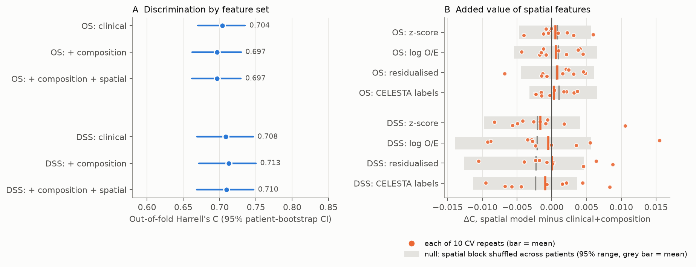
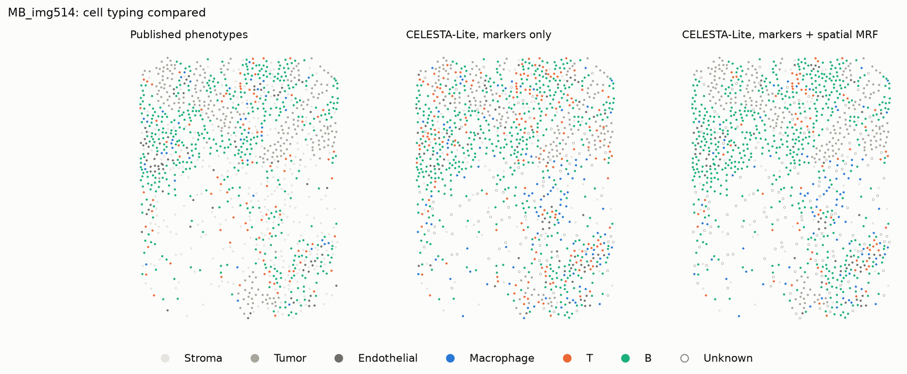

# Do spatial tumor-microenvironment features add prognostic value in breast cancer?

A methods note on two imaging mass cytometry (IMC) breast cancer cohorts: Basel (Jackson et al. 2020, *Nature*) and METABRIC (Danenberg et al. 2022, *Nature Genetics*). The analysis asks whether per-patient cell-type composition, and then spatial-interaction features, improve out-of-fold survival prediction **beyond standard clinical variables**.
- **Part I:** discovery in Basel.
- **Part II:** a pre-registered external replication in METABRIC.
- **Part III:** re-typing the METABRIC cells with **CELESTA-Lite**, a Python port of the CELESTA spatial cell-typing engine, to see whether better-informed cell labels change the answer.

CPU only. Each part reruns from one command.

| Basel (discovery) | METABRIC (pre-registered replication) |
|:---:|:---:|
|  |  |

**Findings**

1. **Spatial features add no detectable prognostic value, in either cohort.**
   - **Basel**, overall survival (79 deaths): +0.002 C over composition (95% CI −0.005 to +0.008).
   - **METABRIC** (231 deaths and 156 breast-cancer deaths within 15 years): every spatial variant lands within ±0.006 of the composition model. Every 95% CI upper bound is at most +0.005, so gains larger than that are ruled out (§P2.2).
   - Composition doesn't help either: −0.007 in METABRIC.
2. **The one lead from Basel failed its pre-registered test.** Basel suggested a gain for size-robust spatial enrichment on breast-cancer-specific survival.
   - Hypothesis H1 and its decision rule were committed to git before any METABRIC outcome was linked.
   - Result in METABRIC: ΔC = −0.004 (95% CI −0.009 to +0.001), permutation p = 0.810. **Verdict: refuted.**
3. **Two popular "spatial" summaries are mostly composition in disguise.**
   - Across Basel images, the tumor–immune mixing score has ρ = −0.89 with immune-cell fraction, and the immune fraction among tumor cells' neighbours has ρ = +0.92.
   - Permutation z-scores track image size (|ρ| up to 0.55).
   - Removing composition and size from the spatial features, in-fold, does not reveal hidden signal in METABRIC (+0.002 for OS, −0.004 for DSS).
4. **The signal is clinical, and it transfers.**
   - A clinical Cox model trained on Basel reaches C = 0.708 on METABRIC, matching a clinical model cross-validated within METABRIC itself (0.704).
   - Adding Basel-trained composition *hurts* transfer (−0.025, 95% CI −0.044 to −0.006).
   - Calibration slopes show the penalised omics models are overfit (0.76–0.85 in METABRIC), while the heavily ridge-shrunk clinical model is under-confident (1.37–1.64).
5. **Re-typing the cells with CELESTA-Lite changes the cell labels, not the conclusion.**
   - The port's spatial step improves agreement with the published labels for the ambiguous cells it assigns (0.589 vs. 0.398 for markers alone).
   - Overall agreement is moderate (κ = 0.476).
   - Spatial features computed from CELESTA-Lite labels add nothing either (OS +0.000, DSS −0.006).

**What guards the result:**
- Nested CV, split by patient.
- Tests that spy on every model fit and fail if any fit sees a held-out patient.
- A shared patient bootstrap, plus 10 CV repeats and a permutation null.
- A pre-registered external replication, with amendments time-stamped in git.
- Dry runs on outcome-shuffled data, so bugs were fixed without seeing results.
- A test that every table row in this README is reproduced verbatim from saved results.

Deviations are listed in §7 (part I) and in [ANALYSIS_PLAN.md](ANALYSIS_PLAN.md) amendments (part II).

---

## 1. Question and relation to prior work

On a single cohort, does each added layer improve out-of-fold discrimination (Harrell's C) of overall survival? The layers are clinical → + cell-type composition → + spatial interactions.

This question is narrower than the claims of the source paper. **Jackson et al. 2020** profiled 35 markers in 720 IMC images from 352 patients, 281 of them with long-term survival data (the Basel cohort used here). They defined 18 single-cell pathology (SCP) subgroups from cell phenotypes and their community organisation, and these subgroups differed in outcome. That is a group-level association discovered on the whole cohort. It does not measure how much out-of-fold discrimination these data add once standard clinical variables are already in the model, which is the question here. A null result here is therefore not in tension with theirs.

The mixing score adapts **Keren et al. 2018** (MIBI-TOF, 41 triple-negative breast cancers), who described "mixed" vs. "compartmentalized" tumor–immune architecture and linked compartmentalization to survival. In this cohort my variant of the score is largely explained by immune content (finding 3), so it should be read alongside composition, not instead of it. **Danenberg et al. 2022** (693 METABRIC tumors) found recurrent multicellular TME structures, including a "suppressed expansion" structure that predicted poor outcome in ER-positive disease. That suggests prognostic spatial information may require richer descriptors and more patients than this pre-specified panel of 11 features on 280 patients.

## 2. Data

**Source.** Zenodo [10.5281/zenodo.4607374](https://doi.org/10.5281/zenodo.4607374); the earlier version, 3518284, holds a subset of the same files. `scripts/download_data.py` lists the record, verifies MD5 checksums, and fetches only:

| File | Size | Contents used |
|---|---|---|
| `singlecell_cluster_labels.zip` | 7.9 MB | `Basel_metaclusters.csv` (cell id → metacluster 1–27), `Metacluster_annotations.csv` |
| `singlecell_locations.zip` | 23.2 MB | `Basel_SC_locations.csv` (cell id, core, `Location_Center_X/Y`) |
| `SingleCell_and_Metadata.zip` (36.8 GB) | **not downloaded** | only `Data_publication/BaselTMA/Basel_PatientMetadata.csv` (0.16 MB), extracted with HTTP range requests (a few MB transferred, CRC-checked) |

**Cohort: Basel only.** Basel has a standalone patient-metadata table with survival. Zurich clinical data exists only inside a 3.7 GB histoCAT MATLAB session, so Zurich is not used.

**Filtering.** 376 cores → 289 tumor cores (`diseasestatus == "tumor"`; normal-tissue cores excluded) → 281 patients → **N = 280** after dropping one patient with `OSmonth = 0`. The final cohort has 288 images and 762,776 labelled cells. 8 patients have two tumor cores, and their clinical fields are identical across cores.

**Endpoints.**
- **Overall survival (OS, primary).** Time = `OSmonth`; event = any death, **79 events**. "alive" and "alive w metastases" are censored. Median follow-up time across all patients is 74 months.
- **Breast-cancer-specific survival (DSS, secondary; agreed before modelling).** Only "death by primary disease" counts, **57 events**; other deaths are censored.

**Patient-level aggregation.** For composition, cells from all of a patient's tumor cores are pooled. Spatial features are computed per image and averaged per patient, weighted by cell count.

## 3. Features


*Example cores: one dot per cell. Tumor (dark grey), stroma (light grey) and endothelium are context; immune classes are coloured. All three cores come from images between the 40th and 60th percentile of immune fraction, so the figure contrasts **arrangement** at similar **amount**.*

**Clinical (7).** Age, tumor size (mm), grade (1–3, ordinal), pN (0–3; "x" → missing), and ER, PR, HER2 (positive = 1). Missing values (pN 13, ER 1, PR 6) are median-imputed inside each training fold. pM and one-hot grade were dropped for numerical reasons (§7). pT was left out as redundant with tumor size, and treatment because it is decided after baseline.

**Composition (27).** Counts of the 27 published metaclusters per patient, CLR-transformed: add a pseudocount of 0.5 cells, close each row, log, and centre each row on its own mean. CLR is row-wise; the standardisation that follows is fit on training folds only.

**Spatial (11), pre-specified.** Per image:
- **Graph.** Undirected kNN graph, k = 8, on cell centroids. IMC pixels are 1 µm. I chose kNN over a 20 µm radius because it adapts to local density and leaves no cell isolated.
- **Coarse classes** (from the metacluster annotations):
  - Tumor (all 14 "Tumor"-class clusters)
  - T (3, 5)
  - B (1 B cell, 2 T & B cells)
  - Macrophage (4, 6)
  - Endothelial (7)
  - Stroma (8–13)
- **Neighbour enrichment, 9 pairs.** Tumor–Tumor, Tumor–T, Tumor–Macrophage, Tumor–B, Tumor–Stroma, Tumor–Endothelial, T–Macrophage, T–B, Stroma–T. The statistic is the undirected edge count between two classes, as a z-score against 200 within-image label permutations (graph fixed, labels shuffled, which preserves composition). It is missing if either class has fewer than 5 cells; missing values are imputed in-fold.
- **`tumor_immune_nbr_frac`.** The mean fraction of immune cells among each tumor cell's 8 neighbours.
- **`tumor_immune_mixing`.** Tumor–immune edges / (tumor–immune + immune–immune edges), a bounded variant of Keren et al.

The enrichment code is unit-tested against a hand-computed exact null and the closed-form permutation mean.

**Sensitivity variant (post hoc, §7).** z-scores grow with the number of edges in an image, so the full model was also fit with **log₂((observed + 1)/(expected + 1))** for the 9 pairs.

## 4. Models and validation

- **Clinical model:** ridge Cox (`CoxPHSurvivalAnalysis`), with α chosen from 20 log-spaced values between 10⁻² and 10³.
- **Models with omics blocks:** elastic-net Cox (`CoxnetSurvivalAnalysis`, l1_ratio 0.5) with clinical columns **unpenalized**, so they nest the clinical model. α is chosen from a 20-point path derived from each outer-training set.
- **Tuning effort is identical:** one penalty, 20 candidates, inner 5-fold CV stratified by event, selected by mean Harrell's C.
- **Baseline:** random Gaussian risk scores, as a sanity check that C ≈ 0.5.
- **Outer CV:** 5-fold stratified by event, repeated with 3 seeds, using the same folds for every model. Rows are patients, so all splits are by patient.
- **Leakage control:** imputation, scaling and the α path are fit inside training folds. A test spies on every fit inside the nested CV and asserts that none sees an outer-test patient.
- **Metric:** Harrell's C on the **pooled** out-of-fold predictions of each CV repeat, averaged over repeats.
- **Uncertainty, three ways:**
  1. A 1,000-resample patient bootstrap shared by all models (paired differences, percentile CIs). It holds the out-of-fold predictions fixed.
  2. 10 CV repeats, which capture partition variability.
  3. A permutation null: shuffle the spatial block across patients and rerun the full nested CV (20 permutations × 3 seeds). This shows how much C a penalised model gains from 11 features that carry no outcome information.

## 5. Results

### 5.1 Overall survival (primary)

| Model | C-index | 95% CI | per CV repeat (seeds 0, 1, 2) |
|---|---|---|---|
| clinical | 0.741 | 0.687 to 0.792 | 0.735, 0.755, 0.733 |
| clinical+composition | 0.748 | 0.690 to 0.801 | 0.740, 0.760, 0.743 |
| clinical+composition+spatial | 0.750 | 0.693 to 0.803 | 0.742, 0.760, 0.747 |
| clinical+composition+spatial (log O/E, sensitivity) | 0.744 | 0.688 to 0.796 | 0.742, 0.740, 0.750 |
| random baseline | 0.503 | 0.465 to 0.540 | 0.564, 0.484, 0.461 |

| Comparison | ΔC | 95% CI | share of bootstrap Δ > 0 |
|---|---|---|---|
| clinical+composition minus clinical | +0.007 | -0.017 to +0.029 | 0.67 |
| clinical+composition+spatial minus clinical+composition | +0.002 | -0.005 to +0.008 | 0.70 |
| clinical+composition+spatial minus clinical | +0.009 | -0.014 to +0.031 | 0.74 |
| clinical+composition+spatial (log O/E, sensitivity) minus clinical+composition | -0.004 | -0.014 to +0.006 | 0.24 |

| Spatial model vs. clinical+composition | ΔC (3 main repeats) | ΔC over 10 CV repeats: mean ± SD [min, max] | repeats with Δ > 0 | permuted-spatial null ΔC: mean ± SD (max) | permutation p |
|---|---|---|---|---|---|
| clinical+composition+spatial | +0.002 | -0.002 ± 0.006 [-0.012, +0.007] | 4/10 | +0.002 ± 0.003 (+0.005) | 0.667 |
| clinical+composition+spatial (log O/E, sensitivity) | -0.004 | +0.001 ± 0.010 [-0.020, +0.016] | 7/10 | +0.001 ± 0.003 (+0.006) | 0.952 |

### 5.2 Breast-cancer-specific survival (secondary)

| Model | C-index | 95% CI | per CV repeat (seeds 0, 1, 2) |
|---|---|---|---|
| clinical | 0.721 | 0.660 to 0.777 | 0.734, 0.737, 0.693 |
| clinical+composition | 0.723 | 0.660 to 0.780 | 0.753, 0.707, 0.710 |
| clinical+composition+spatial | 0.738 | 0.677 to 0.792 | 0.759, 0.739, 0.715 |
| clinical+composition+spatial (log O/E, sensitivity) | 0.751 | 0.691 to 0.803 | 0.768, 0.748, 0.736 |
| random baseline | 0.505 | 0.459 to 0.553 | 0.561, 0.464, 0.489 |

| Comparison | ΔC | 95% CI | share of bootstrap Δ > 0 |
|---|---|---|---|
| clinical+composition minus clinical | +0.002 | -0.038 to +0.040 | 0.54 |
| clinical+composition+spatial minus clinical+composition | +0.014 | +0.000 to +0.031 | 0.97 |
| clinical+composition+spatial minus clinical | +0.017 | -0.021 to +0.052 | 0.81 |
| clinical+composition+spatial (log O/E, sensitivity) minus clinical+composition | +0.028 | +0.008 to +0.050 | 1.00 |

| Spatial model vs. clinical+composition | ΔC (3 main repeats) | ΔC over 10 CV repeats: mean ± SD [min, max] | repeats with Δ > 0 | permuted-spatial null ΔC: mean ± SD (max) | permutation p |
|---|---|---|---|---|---|
| clinical+composition+spatial | +0.014 | +0.002 ± 0.014 [-0.021, +0.032] | 7/10 | +0.007 ± 0.008 (+0.023) | 0.143 |
| clinical+composition+spatial (log O/E, sensitivity) | +0.028 | +0.011 ± 0.017 [-0.018, +0.041] | 8/10 | +0.005 ± 0.008 (+0.016) | 0.048 |

The permutation p is (1 + number of null deltas ≥ observed)/(1 + 20), so its smallest possible value is 0.048. The bootstrap CIs alone would have suggested a DSS gain (lower bounds +0.000 and +0.008). The CV-repeat and permutation analyses show how much of that came from the particular 3 CV partitions: even shuffled spatial features "gain" +0.007 on average for DSS.

### 5.3 Kaplan–Meier (median split of out-of-fold risk)

The best OS model by C-index (`clinical+composition+spatial`) gives log-rank p = 6.5e-09. The clinical-only model gives p = 8.3e-10, and the two put 94% of patients in the same risk half. Risk is the mean out-of-fold rank over the 3 CV repeats.

| Best model | Clinical only |
|:---:|:---:|
|  |  |

### 5.4 How large a gain could this cohort detect?

Approximate detectable ΔC at 80% power and two-sided α = 0.05, computed as 2.80 × the SD of the paired bootstrap difference. The last column also adds CV-repeat variability.

| Endpoint | Comparison | SD of paired bootstrap ΔC | detectable ΔC (80% power) | with CV-repeat variability |
|---|---|---|---|---|
| OS | clinical+composition minus clinical | 0.0120 | 0.034 | n/a |
| OS | clinical+composition+spatial minus clinical+composition | 0.0035 | 0.010 | 0.014 |
| DSS | clinical+composition minus clinical | 0.0200 | 0.056 | n/a |
| DSS | clinical+composition+spatial minus clinical+composition | 0.0079 | 0.022 | 0.032 |

For OS this design would usually have detected a spatial gain of about 0.01–0.014 C. The estimate is +0.002 with an upper CI bound of +0.008, so the data argue against a gain of that size, not merely fail to find one. For composition over clinical, only gains of about 0.03 or more were detectable, so smaller composition effects cannot be excluded.

### 5.5 Are the spatial features measuring something other than composition and image size?

Image-level Spearman correlations (288 images):

| Feature | ρ with log(cells): z-score | ρ with log(cells): log O/E | ρ with immune fraction: z-score | ρ with immune fraction: log O/E |
|---|---|---|---|---|
| `enrich_Tumor__Tumor` | +0.55 | -0.29 | +0.24 | +0.67 |
| `enrich_Tumor__T` | -0.44 | -0.03 | -0.43 | -0.24 |
| `enrich_Tumor__Macrophage` | -0.30 | -0.02 | -0.15 | -0.21 |
| `enrich_Tumor__B` | -0.21 | +0.06 | -0.47 | -0.42 |
| `enrich_Tumor__Stroma` | -0.41 | -0.21 | +0.38 | +0.12 |
| `enrich_Tumor__Endothelial` | -0.51 | -0.10 | +0.22 | -0.06 |
| `enrich_T__Macrophage` | +0.30 | +0.30 | +0.11 | -0.34 |
| `enrich_T__B` | -0.03 | -0.06 | +0.31 | -0.08 |
| `enrich_Stroma__T` | +0.39 | +0.38 | -0.47 | -0.65 |
| `tumor_immune_nbr_frac` | -0.17 | (same feature) | +0.92 | (same feature) |
| `tumor_immune_mixing` | +0.19 | (same feature) | -0.89 | (same feature) |

- **Mixing and neighbour fraction are near-composition proxies.** They are ratios of edge counts, and edge counts scale with how many immune cells there are. When immune cells are sparse, each one mostly touches tumor, so "mixing" is high. When immune cells are dense, they touch each other.
- **The z-scores are size-dependent.** The O/E version removes most of that dependence for tumor-centred pairs, but several O/E features correlate *more* strongly with immune fraction (e.g. Tumor–Tumor +0.67, Stroma–T −0.65).
- **Implication.** No feature in this panel is a clean "arrangement independent of amount" measure. A future panel should be checked against both axes before modelling, e.g. by residualising on composition and size, or by using statistics conditioned on composition.

<details>
<summary><b>5.6 Exploratory: spatial coefficients and model sparsity</b> (click to expand)</summary>

These are standardised log-hazard coefficients of the spatial features in `clinical+composition+spatial`, averaged over the 15 outer-fold fits, with the share of folds in which the elastic net kept each feature. The inputs are correlated and shrunk, so **these are not effect estimates**. For DSS, the most consistently kept feature is Tumor–T enrichment, with a *positive* coefficient (more tumor–T contact than chance goes with higher hazard). Its z-score correlates with both image size (−0.44) and immune fraction (−0.43), so I would not interpret the sign.

OS:

| Spatial feature | mean coef | SD | selected in folds |
|---|---|---|---|
| `tumor_immune_mixing` | +0.045 | 0.077 | 33% |
| `enrich_T__Macrophage` | -0.037 | 0.062 | 33% |
| `enrich_Tumor__Macrophage` | +0.011 | 0.034 | 13% |
| `enrich_Tumor__T` | +0.007 | 0.025 | 13% |
| `enrich_Stroma__T` | +0.007 | 0.025 | 7% |
| `enrich_Tumor__Endothelial` | +0.003 | 0.011 | 7% |
| `enrich_Tumor__Tumor` | +0.000 | 0.000 | 0% |
| `enrich_Tumor__B` | +0.000 | 0.000 | 0% |
| `enrich_Tumor__Stroma` | +0.000 | 0.000 | 0% |
| `enrich_T__B` | +0.000 | 0.000 | 0% |
| `tumor_immune_nbr_frac` | +0.000 | 0.000 | 0% |

DSS:

| Spatial feature | mean coef | SD | selected in folds |
|---|---|---|---|
| `enrich_Tumor__T` | +0.091 | 0.066 | 87% |
| `enrich_T__Macrophage` | -0.069 | 0.074 | 80% |
| `tumor_immune_mixing` | +0.064 | 0.070 | 60% |
| `enrich_Tumor__Tumor` | -0.017 | 0.034 | 33% |
| `enrich_Tumor__Macrophage` | +0.011 | 0.019 | 33% |
| `enrich_Tumor__B` | +0.008 | 0.030 | 7% |
| `tumor_immune_nbr_frac` | +0.007 | 0.019 | 13% |
| `enrich_Tumor__Endothelial` | +0.000 | 0.000 | 0% |
| `enrich_Tumor__Stroma` | +0.000 | 0.000 | 0% |
| `enrich_Stroma__T` | +0.000 | 0.000 | 0% |
| `enrich_T__B` | +0.000 | 0.000 | 0% |

Penalty choice and sparsity across the 15 outer folds:

| Endpoint | Model | selected penalty α: median [min, max] | non-zero omics coefs: median [min, max] |
|---|---|---|---|
| OS | clinical | 88.6 [0.379, 1e+03] | 0 [0, 0] |
| OS | clinical+composition | 0.104 [0.0247, 0.146] | 1 [0, 15] |
| OS | clinical+composition+spatial | 0.128 [0.034, 0.183] | 1 [0, 19] |
| OS | clinical+composition+spatial (log O/E, sensitivity) | 0.102 [0.0262, 0.196] | 3 [0, 22] |
| DSS | clinical | 88.6 [0.0616, 1e+03] | 0 [0, 0] |
| DSS | clinical+composition | 0.0532 [0.00914, 0.12] | 8 [0, 21] |
| DSS | clinical+composition+spatial | 0.0566 [0.0256, 0.155] | 10 [0, 20] |
| DSS | clinical+composition+spatial (log O/E, sensitivity) | 0.0511 [0.0256, 0.146] | 11 [0, 21] |


</details>

## 6. Interpretation

- **The clinical model is hard to beat.** Age, size, grade, nodes and receptor status give C ≈ 0.74. Adding 27 composition features and 11 spatial features does not measurably improve on it for OS, and the elastic net usually keeps only about one omics feature (median) when predicting OS.
- **This does not show that spatial organisation is irrelevant to breast cancer outcome.** It shows that *this* panel, on single small cores from 280 patients, carries no detectable *incremental, out-of-fold* information about OS beyond clinical variables. It also shows that two of its most intuitive features largely re-measure composition.
- **The DSS hint is worth one pre-registered test elsewhere, not a claim.** Spatial organisation could plausibly matter more for cancer-specific death than for all-cause death, which includes 22 non-cancer deaths here. But the signal is unstable across CV partitions and comes from a post-hoc variant.

## 7. Deviations from the original plan

1. **Grade is ordinal, not one-hot, and pM is not modelled.** Grade 1 has only 2 disease-specific deaths in 38 patients, and only 7/280 patients are M1. In some CV training folds this produced quasi-separation, and the unpenalized clinical coefficients diverged (Coxnet raised numerical errors). The change was made because of fit failures, not C-index values. A first OS run with the original encoding did finish before the DSS failure. It was not saved, so no numbers from it are reported. It showed the same pattern of small, CI-spanning gains.
2. **Added after seeing first results:** the log O/E spatial variant, the 10 CV repeats, the permutation null, the detectable-effect calculation, and the composition/size confound check. They are robustness and sensitivity analyses and do not redefine the primary model. They were added because the first DSS result looked too good to trust.
3. **DSS** was agreed as a secondary endpoint before modelling.

## Part II: pre-registered external replication in METABRIC

### P2.1 Design

The analysis plan, [ANALYSIS_PLAN.md](ANALYSIS_PLAN.md), was committed to git before any METABRIC outcome was linked to features. Three amendments followed, each committed before outcomes were linked and each giving its reason:
1. the cell-class mapping;
2. a correction to how the calibration slope is defined;
3. an ER-negative column rule and the CELESTA-Lite labels.

Before the real run, every code path was dry-run on data with **outcomes shuffled across patients**. In that run all models sat near C = 0.5, so the bugs it surfaced were fixed without any real result being visible.

- **Data.** METABRIC IMC single cells (Zenodo 10.5281/zenodo.5850952; one 383 MB member range-extracted from a 6.2 GB archive) and public cBioPortal clinical data (`brca_metabric`).
- **Cells.** Invasive-tumour images only; imaging-artefact cells removed.
- **Cohort.** Patients with at least 500 cells and some epithelium: **N = 492** (543 images, 904,202 cells).
- **Endpoints.** OS and breast-cancer-specific survival (DSS), administratively censored at 15 years, the horizon fixed in the plan. That leaves 231 OS events and 156 DSS events.
- **Clinical variables.** The same 7 as Basel. pN is derived from the positive-node count using the AJCC bands.
- **Cell classes.** The published phenotypes are mapped to Basel's 6 coarse classes; the table is in Amendment 1.
- **Models and protocol.** Identical to part I.

### P2.2 Within-METABRIC replication (A1) and the confirmatory test (H1)

Overall survival:

| Model | C-index | 95% CI | per CV repeat (seeds 0, 1, 2) |
|---|---|---|---|
| clinical | 0.704 | 0.670 to 0.735 | 0.711, 0.695, 0.705 |
| clinical+composition | 0.697 | 0.662 to 0.730 | 0.700, 0.688, 0.702 |
| +spatial (z) | 0.697 | 0.662 to 0.729 | 0.701, 0.688, 0.701 |
| +spatial (log O/E) | 0.698 | 0.663 to 0.730 | 0.703, 0.692, 0.700 |
| +spatial (residualised) | 0.699 | 0.663 to 0.731 | 0.703, 0.691, 0.703 |
| +spatial (log O/E, CELESTA labels) | 0.697 | 0.662 to 0.729 | 0.698, 0.690, 0.702 |
| random baseline | 0.497 | 0.475 to 0.520 | 0.495, 0.487, 0.510 |

| Comparison | ΔC | 95% CI | share of bootstrap Δ > 0 |
|---|---|---|---|
| clinical+composition minus clinical | -0.007 | -0.020 to +0.007 | 0.16 |
| +spatial (z) minus clinical+composition | -0.000 | -0.003 to +0.003 | 0.49 |
| +spatial (log O/E) minus clinical+composition | +0.001 | -0.002 to +0.005 | 0.79 |
| +spatial (residualised) minus clinical+composition | +0.002 | -0.001 to +0.005 | 0.90 |
| +spatial (log O/E, CELESTA labels) minus clinical+composition | +0.000 | -0.003 to +0.003 | 0.49 |

Breast-cancer-specific survival:

| Model | C-index | 95% CI | per CV repeat (seeds 0, 1, 2) |
|---|---|---|---|
| clinical | 0.708 | 0.669 to 0.746 | 0.700, 0.716, 0.709 |
| clinical+composition | 0.713 | 0.672 to 0.750 | 0.702, 0.718, 0.718 |
| +spatial (z) | 0.710 | 0.669 to 0.747 | 0.701, 0.715, 0.713 |
| +spatial (log O/E) | 0.709 | 0.667 to 0.747 | 0.702, 0.709, 0.716 |
| +spatial (residualised) | 0.708 | 0.667 to 0.746 | 0.702, 0.707, 0.716 |
| +spatial (log O/E, CELESTA labels) | 0.707 | 0.665 to 0.746 | 0.701, 0.711, 0.709 |
| random baseline | 0.495 | 0.469 to 0.522 | 0.491, 0.497, 0.497 |

| Comparison | ΔC | 95% CI | share of bootstrap Δ > 0 |
|---|---|---|---|
| clinical+composition minus clinical | +0.004 | -0.010 to +0.020 | 0.74 |
| +spatial (z) minus clinical+composition | -0.003 | -0.008 to +0.002 | 0.14 |
| +spatial (log O/E) minus clinical+composition | -0.004 | -0.009 to +0.001 | 0.06 |
| +spatial (residualised) minus clinical+composition | -0.004 | -0.011 to +0.002 | 0.09 |
| +spatial (log O/E, CELESTA labels) minus clinical+composition | -0.006 | -0.011 to -0.001 | 0.01 |

**H1, the only confirmatory test in part II.** Under the pre-registered rule, H1 is supported only if (a) the CI lies above 0, (b) the permutation p ≤ 0.05, and (c) the mean over 10 CV repeats is > 0. It is refuted if ΔC ≤ 0.

| ΔC (log O/E minus composition, DSS) | 95% CI | permutation p | mean ΔC over 10 CV repeats | (a) CI > 0 | (b) p ≤ 0.05 | (c) repeat mean > 0 | verdict |
|---|---|---|---|---|---|---|---|
| -0.004 | -0.009 to +0.001 | 0.810 | -0.001 | no | no | no | **refuted** |

The Basel DSS lead (part I, §5.2) did not replicate. Every spatial variant, including the residualised and CELESTA-label versions, has its 10-repeat deltas inside the shuffled-feature null (headline figure, right). The CELESTA-label model's DSS bootstrap CI excludes 0 *below* zero; adding those features slightly hurt.

<details>
<summary>CV-repeat and permutation-null details for METABRIC (click to expand)</summary>

OS:

| Spatial model vs. clinical+composition | ΔC (3 main repeats) | ΔC over 10 CV repeats: mean ± SD [min, max] | repeats with Δ > 0 | permuted-spatial null ΔC: mean ± SD (max) | permutation p |
|---|---|---|---|---|---|
| +spatial (z) | -0.000 | +0.001 ± 0.003 [-0.004, +0.006] | 4/10 | +0.001 ± 0.001 (+0.004) | 0.857 |
| +spatial (log O/E) | +0.001 | +0.001 ± 0.003 [-0.004, +0.004] | 5/10 | +0.001 ± 0.001 (+0.003) | 0.286 |
| +spatial (residualised) | +0.002 | +0.001 ± 0.003 [-0.007, +0.005] | 6/10 | +0.001 ± 0.001 (+0.002) | 0.190 |
| +spatial (log O/E, CELESTA labels) | +0.000 | +0.000 ± 0.002 [-0.002, +0.004] | 5/10 | +0.001 ± 0.001 (+0.004) | 0.810 |

DSS:

| Spatial model vs. clinical+composition | ΔC (3 main repeats) | ΔC over 10 CV repeats: mean ± SD [min, max] | repeats with Δ > 0 | permuted-spatial null ΔC: mean ± SD (max) | permutation p |
|---|---|---|---|---|---|
| +spatial (z) | -0.003 | -0.002 ± 0.005 [-0.008, +0.011] | 2/10 | -0.002 ± 0.002 (+0.003) | 0.762 |
| +spatial (log O/E) | -0.004 | -0.001 ± 0.007 [-0.009, +0.016] | 3/10 | -0.002 ± 0.003 (+0.003) | 0.810 |
| +spatial (residualised) | -0.004 | +0.000 ± 0.006 [-0.011, +0.009] | 5/10 | -0.002 ± 0.002 (+0.001) | 0.857 |
| +spatial (log O/E, CELESTA labels) | -0.006 | -0.001 ± 0.006 [-0.010, +0.008] | 5/10 | -0.002 ± 0.002 (+0.001) | 0.857 |

</details>

### P2.3 Transfer: trained on Basel, tested once on METABRIC (A2)

These models use only features that exist in both cohorts, so composition is the 6 coarse classes. Scalers and imputers were fit on Basel only.

OS:

| Model (trained on Basel) | external C-index on METABRIC | 95% CI |
|---|---|---|
| clinical | 0.708 | 0.674 to 0.739 |
| clinical+composition | 0.683 | 0.649 to 0.717 |
| +spatial (z) | 0.684 | 0.651 to 0.717 |
| +spatial (log O/E) | 0.684 | 0.650 to 0.717 |

| Transfer comparison | ΔC | 95% CI | share of bootstrap Δ > 0 |
|---|---|---|---|
| clinical+composition minus clinical | -0.025 | -0.044 to -0.006 | 0.00 |
| +spatial (z) minus clinical+composition | +0.001 | -0.002 to +0.005 | 0.73 |
| +spatial (log O/E) minus clinical+composition | +0.000 | -0.006 to +0.007 | 0.55 |

DSS:

| Model (trained on Basel) | external C-index on METABRIC | 95% CI |
|---|---|---|
| clinical | 0.702 | 0.661 to 0.738 |
| clinical+composition | 0.689 | 0.646 to 0.728 |
| +spatial (z) | 0.686 | 0.644 to 0.724 |
| +spatial (log O/E) | 0.688 | 0.646 to 0.727 |

| Transfer comparison | ΔC | 95% CI | share of bootstrap Δ > 0 |
|---|---|---|---|
| clinical+composition minus clinical | -0.013 | -0.023 to -0.003 | 0.01 |
| +spatial (z) minus clinical+composition | -0.003 | -0.008 to +0.002 | 0.14 |
| +spatial (log O/E) minus clinical+composition | -0.001 | -0.014 to +0.012 | 0.44 |

- **The clinical model transfers intact.** Its external C equals what METABRIC achieves internally.
- **Basel composition does not transfer.** Adding it costs 0.025 (OS) and 0.013 (DSS), with CIs excluding 0. The likely reasons are that the coarse classes come from different panels and phenotyping pipelines in the two studies, and that composition coefficients learned on 280 patients are partly noise.
- **Spatial features neither help nor hurt transfer.**

### P2.4 Calibration and time-dependent AUC (C)

The calibration slope regresses the outcome on the out-of-fold linear predictor (1 is ideal; < 1 means overfit, too-extreme predictions). Time-dependent AUC is cumulative/dynamic, with IPCW.

METABRIC, OS:

| Model | calibration slope (95% CI) | AUC at 60 months | AUC at 120 months |
|---|---|---|---|
| clinical | 1.37 (1.08 to 2.17) | 0.76 (0.71 to 0.81) | 0.76 (0.71 to 0.80) |
| clinical+composition | 0.76 (0.62 to 0.98) | 0.75 (0.70 to 0.80) | 0.75 (0.70 to 0.80) |
| +spatial (z) | 0.77 (0.62 to 0.99) | 0.75 (0.69 to 0.80) | 0.75 (0.70 to 0.80) |
| +spatial (log O/E) | 0.77 (0.63 to 0.98) | 0.75 (0.70 to 0.80) | 0.75 (0.70 to 0.80) |
| +spatial (residualised) | 0.77 (0.63 to 1.00) | 0.75 (0.70 to 0.80) | 0.75 (0.71 to 0.80) |
| +spatial (log O/E, CELESTA labels) | 0.76 (0.62 to 0.99) | 0.75 (0.70 to 0.79) | 0.75 (0.70 to 0.80) |
| random baseline | -0.04 (-0.11 to 0.04) | 0.51 (0.48 to 0.54) | 0.49 (0.45 to 0.52) |

METABRIC, DSS:

| Model | calibration slope (95% CI) | AUC at 60 months | AUC at 120 months |
|---|---|---|---|
| clinical | 1.64 (1.38 to 2.02) | 0.78 (0.72 to 0.83) | 0.73 (0.67 to 0.78) |
| clinical+composition | 0.85 (0.65 to 1.08) | 0.78 (0.73 to 0.83) | 0.74 (0.69 to 0.79) |
| +spatial (z) | 0.81 (0.62 to 1.02) | 0.78 (0.73 to 0.82) | 0.74 (0.68 to 0.79) |
| +spatial (log O/E) | 0.82 (0.63 to 1.04) | 0.78 (0.73 to 0.83) | 0.74 (0.68 to 0.78) |
| +spatial (residualised) | 0.81 (0.63 to 1.03) | 0.78 (0.72 to 0.82) | 0.74 (0.68 to 0.78) |
| +spatial (log O/E, CELESTA labels) | 0.81 (0.62 to 1.05) | 0.77 (0.72 to 0.82) | 0.73 (0.68 to 0.78) |
| random baseline | -0.03 (-0.13 to 0.06) | 0.50 (0.46 to 0.53) | 0.48 (0.44 to 0.52) |

- **Time-dependent AUC** tells the same story as Harrell's C: no layer improves on clinical.
- **Calibration** separates the models.
  - The omics models (slope ≈ 0.8) are mildly overfit: the elastic net keeps clinical columns unpenalised and adds noisy omics terms.
  - The clinical ridge model is *under*-confident (slope 1.37–1.64). Its inner CV often picks a very large ridge penalty, sometimes at the edge of the grid (part I, §9). That shrinks the linear predictor without changing its ranking, which is why discrimination is unaffected.
  - Basel shows the same pattern (generated tables: `results/part2/tables.md`, section C).
- **Practical note:** a discrimination-only comparison would have missed both problems.

### P2.5 Composition-conditioned ("residualised") spatial features (B) and the ER-negative subgroup (D)

- **Residualised spatial features.** Each spatial feature is replaced by its residual after regression on CLR composition and log cell count, fit in-fold (`ResidualizeSpatial`, unit-tested to remove a planted composition effect and keep a planted arrangement effect).
  - In METABRIC (pre-registered secondary): no gain (tables above).
  - In Basel (exploratory, since those data had already been seen): the DSS gain is +0.022 on the 3 main repeats but +0.001 ± 0.022 across 10 repeats. This repeats the part I pattern of a favourable partition, not a signal.
- **ER-negative subgroup** (exploratory, gated on ≥ 40 DSS events; 106 patients, 48 events). ER and PR were dropped as near-constant (Amendment 3a).
  - For DSS, z-score spatial features gain +0.036 on the 3 main repeats and +0.027 ± 0.026 across 10 repeats (9/10 positive), with permutation p = 0.095.
  - This is the only setting in the study where spatial features lean consistently positive, and immune organisation is biologically most plausible in ER-negative disease.
  - It is exploratory, one of many subgroup comparisons, and does not reach the permutation threshold, so it is reported as a lead and not a finding. Full tables are in `results/part2/tables.md`.

## Part III: CELESTA-Lite, spatially informed cell typing

[CELESTA](https://doi.org/10.1038/s41592-022-01498-z) (Zhang et al., *Nature Methods* 2022) assigns cell types from marker expression and, for ambiguous cells, from the types of their spatial neighbours (a Potts-model Markov random field). `src/celesta_lite/` is a vectorised Python port that follows the authors' reference R code (plevritis-lab/CELESTA):
- **Marker probabilities:** an equal-weight two-component mixture per marker.
- **Anchor cells:** cells assigned from markers alone (high markers EP ≥ 0.7, low markers EP ≤ 0.9).
- **Index cells:** the rest, assigned by a mean-field update u_ik ∝ exp(F_ik) · exp(β_ik Σ_{j∈kNN(i), s_j=k} p_jk), with β_ik = 5(1 − d_ik/h).
- **Signature updating** toward the cells already assigned.
- **Convergence** when fewer than 1% of cells change per iteration.

It is independent of, and not endorsed by, the original authors.

**Troubleshooting that mattered:**
1. **Anchor threshold.** A first version, built from the paper text, found zero anchor cells: it required a cell-type probability ≥ 0.5. The reference code's default threshold is 0.
2. **Marker-probability scale.** The reference maps expression to EP with a slope-1 sigmoid of (x − crossing point). That suits CODEX intensities, which span several arcsinh units. On METABRIC's dim IMC channels the sigmoid is nearly flat: CD3's two mixture components sit only 0.15 arcsinh units apart (`results/celesta/v1/marker_models.csv`). The port adds a scale-free option, the mixture posterior P(high | x) made monotone around the crossing point, and uses it here. The reference method remains the library default. Both were run on all cells with the v1 signature:

| EP method | artifact-filtered | cells assigned | agreement (assigned) | κ (assigned) | CELESTA T cells | T recall | mean CD3 EP, published T | mean CD3 EP, published Tumor |
|---|---|---|---|---|---|---|---|---|
| reference (sigmoid of x − crossing point) | 24.3% | 62.8% | 0.876 | 0.628 | 575 | 0.00 | 0.16 | 0.09 |
| posterior (this port) | 4.9% | 92.2% | 0.673 | 0.476 | 79,788 | 0.33 | 0.71 | 0.47 |

   With the reference EP, a quarter of all cells fall to the artifact filter (every marker EP below 0.4, or every one above 0.9), and the method finds almost no T cells. Its higher agreement comes from abstaining: it labels only the cells whose panCK or CD20 signal is unambiguous. The posterior EP restores a usable CD3 contrast (0.71 vs. 0.47), at the price of lower agreement on a much larger set of cells. Reproduce with the `v1_reference_ep` run.



**Applied to all 1,066,966 METABRIC tumour cells** (cohort-level marker mixtures, then the MRF per image). It runs in about 2 minutes on a laptop. Agreement is measured against the published phenotypes, which are themselves clustering output, so this is concordance and not accuracy:

| Signature | Labelling | cells assigned | agreement (assigned cells) | Cohen's κ (assigned cells) |
|---|---|---|---|---|
| v1 | markers only (argmax score) | 95.1% | 0.602 | 0.406 |
| v1 | CELESTA-Lite (markers + spatial MRF) | 92.2% | 0.673 | 0.476 |
| v2 | markers only (argmax score) | 96.2% | 0.600 | 0.406 |
| v2 | CELESTA-Lite (markers + spatial MRF) | 93.6% | 0.669 | 0.475 |

| Signature | non-anchor cells assigned by the MRF | agreement: CELESTA-Lite | agreement: markers only, same cells |
|---|---|---|---|
| v1 | 334,187 | 0.589 | 0.398 |
| v2 | 333,914 | 0.587 | 0.395 |

| Class (v1) | published cells | CELESTA-Lite cells | recall | precision |
|---|---|---|---|---|
| Tumor | 601,652 | 554,518 | 0.83 | 0.90 |
| T | 78,977 | 79,788 | 0.33 | 0.32 |
| B | 39,584 | 62,605 | 0.55 | 0.35 |
| Macrophage | 50,837 | 127,942 | 0.57 | 0.23 |
| Endothelial | 48,508 | 59,322 | 0.38 | 0.31 |
| Stroma | 247,408 | 99,652 | 0.28 | 0.71 |

- **The spatial step does what CELESTA claims.** On the cells markers alone cannot settle, it raises agreement from 0.398 to 0.589.
- **Overall concordance is moderate.** The signature uses only 7 markers, and two of them separate cell types weakly here: CD3 is dim, and CD68 is non-specific. T cells and macrophages are where the methods disagree most. v2, which adds the two fibroblast markers (FSP1, Podoplanin) that v1 omitted, changed almost nothing, so the signature was not tuned further against the published labels.
- **Downstream effect.** Spatial features computed from CELESTA-Lite labels correlate with the published-label features at ρ = 0.82–0.84 for tumor-centred summaries but only 0.18–0.44 for T-cell pairs (`results/part2/tables.md`). The METABRIC model built on them (pre-registered in Amendment 3) adds nothing (§P2.2). Better-informed cell labels did not uncover prognostic spatial signal.

Reproduce: `uv run python scripts/run_celesta_metabric.py`, which writes `results/celesta/{v1,v2,v1_reference_ep}/`.

## 8. Reproduction

```bash
uv sync                                              # Python 3.12, pinned dependencies (pyproject.toml + uv.lock)
uv run python scripts/download_data.py               # Basel: ~31 MB download + 0.16 MB range-extracted; checksums verified
uv run python scripts/run.py                         # part I: results/ and figures/ (a few minutes on a laptop CPU)
uv run python scripts/report_tables.py               # results/tables.md
uv run python scripts/download_data.py --metabric    # METABRIC: 383 MB range-extracted (850 MB on disk) + cBioPortal clinical
uv run python scripts/run_celesta_metabric.py        # part III: results/celesta/ (~2 min per run, 3 runs)
uv run python scripts/run_part2.py                   # part II: results/part2/ (~31 min; needs the CELESTA v1 labels)
uv run python scripts/report_part2.py                # results/part2/tables.md
uv run pytest                                        # 31 tests
```

- **Order matters for part II.** Its CELESTA-label model (Amendment 3) reads `results/celesta/v1/cell_labels.csv.gz`, so run part III first. The labels are committed, so `run_part2.py` also works on its own.
- **METABRIC provenance.** The Zenodo member is CRC-checked against the archive's central directory. The cBioPortal clinical data come from a live API, so the MD5 of the snapshot used here is recorded in `results/part2/data_manifest.json`. A later download that differs from it may shift part II numbers slightly.

- **Listing only.** `scripts/download_data.py --list` lists the record and the 36.8 GB archive's members by reading only its central directory.
- **Configuration and raw records.** Seeds, k, permutations and grids live in `CONFIG` in `scripts/run.py` and are saved to `results/summary.json` with package versions and runtime. Per-fold records (seed, fold, selected α, inner C, test C, non-zero coefficients, test patient IDs) are in `results/{os,dss}_per_fold.csv`. Out-of-fold risks are in `results/{os,dss}_oof_risk.csv`.
- **Determinism.** A run from empty `results/`, `figures/` and spatial-feature cache reproduced `results/tables.md` exactly, apart from the runtime line. Raw risk scores differ between runs only at about 1e-6, which is floating-point noise from multithreaded numerics.

**Tests** (`tests/`):
- **Leakage.** Imputer, scaler and CLR outputs depend only on training rows, and a spy on every fit inside the nested CV confirms no fit sees an outer-test patient.
- **Patient-level splits.** Outer folds partition patients, and multi-image patients collapse to one row before CV.
- **Neighbour enrichment.** An exact hand-worked null on a 4-node path graph, the closed-form permutation mean, and segregated vs. checkerboard layouts.
- **Toy end-to-end.** Simulated images in which T-cell infiltration drives survival at fixed composition; the spatial model must beat the clinical and composition models by more than 0.1 C.
- **Residualisation.** In-fold residualisation removes a planted composition effect, keeps a planted arrangement effect, and is fit on training rows only.
- **METABRIC harmonisation.** The pN banding from node counts, the 180-month censoring, the phenotype-to-class mapping (which reaches every Basel class and fails loudly on an unmapped phenotype), and the cell filters.
- **CELESTA-Lite.** The mixture fit and its crossing point, both EP methods (the posterior is invariant to rescaling the channel), cell-type scores, lineage rounds, the artifact filter, and a toy core where the spatial step must rescue cells whose markers are ambiguous.
- **README integrity.** Every result-table row here appears in `results/tables.md` or `results/part2/tables.md`.

CI (`.github/workflows/tests.yml`) runs the tests on every push.

Layout:
- `scripts/`: `download_data`, `run` and `report_tables` (part I); `run_part2` and `report_part2` (part II); `run_celesta_metabric` (part III).
- `src/spatialsurv/`: `data`, `features`, `models`, `cv`, `eval`, `robustness`, `plots`, `metabric`.
- `src/celesta_lite/`: `preprocessing`, `mrf`, `graph`, `benchmark`.
- Also `tests/`, `results/` (`part2/`, `celesta/`) and `figures/`.

## 9. Caveats and limitations

**Scope of the null result**
- **It concerns incremental value over clinical variables, for this feature panel.** It does not say spatial structure is unrelated to outcome. Danenberg et al. report outcome associations for METABRIC TME structures. Those analyses ask a different question (association, not out-of-fold gain over a clinical model). The panel here is also small: pairwise enrichment, neighbour fractions and mixing on 6 coarse classes. Richer descriptors, such as cellular neighbourhoods, distance-based statistics or the papers' own community features, might behave differently.
- **One small TMA core per patient (rarely two), in both cohorts.** Spatial features describe a tiny sample of each tumor. Rare-class pairs are often undefined (Tumor–B is missing for 108/280 Basel patients and imputed).

**Statistics**
- **Basel is small relative to the feature count.** 280 patients and 79 or 57 events against up to 45 features. Per-model 95% CIs are about ±0.05 wide. METABRIC is larger (§P2.1), which is why its CIs exclude gains above +0.005.
- **Overall survival includes non-cancer deaths.** In Basel that is 22 of 79. DSS censors them, so it estimates a cause-specific hazard, not a cumulative incidence.
- **Harrell's C depends on the censoring distribution.** Calibration and time-dependent AUC are reported in §P2.4. Decision-curve analysis was not done, because no layer cleared the discrimination bar.
- **The clinical ridge α sometimes hits the grid edge** (10³). Large ridge penalties mostly rescale the linear predictor, to which the rank-based C is insensitive. They do affect calibration, which is the under-confidence seen in §P2.4. The grid was not re-tuned after seeing results.
- **The ER-negative lead is one of many exploratory comparisons.** Part I and part II together ran several endpoints, feature variants and a subgroup, and no multiplicity correction is applied to the exploratory ones. Only H1 was confirmatory.

**Cell labels**
- **The cell labels are the published clusterings,** made once on all cells of each cohort. They are outcome-blind, but they are a shared upstream step that a strictly prospective pipeline would not have. Cross-cohort class mapping (Amendment 1) is a judgement call, such as placing CD57⁺ cells with T cells.
- **The published labels are not ground truth.** CELESTA-Lite "agreement" is concordance between two automated methods.
- **CELESTA-Lite departs from the reference in three ways.** It fits marker mixtures once per cohort rather than per sample. It uses a posterior EP rather than the reference sigmoid (Part III). It uses an arcsinh cofactor of 1 for IMC counts. The signature was written from marker biology, and only v1 and v2 were tried. It was not tuned against the published labels.

## 10. Next steps

- **Test the ER-negative lead prospectively.** Run a pre-registered DSS analysis of z-score spatial features in an independent ER-negative or triple-negative cohort with cancer-specific follow-up, with the hypothesis and decision rule fixed in advance, as was done for H1.
- **Richer spatial descriptors under the same protocol.** Cellular neighbourhoods, multi-scale radius graphs and cross-type K/L functions, residualised on composition and image size in-fold as in §P2.5.
- **Competing-risks modelling** (cause-specific Cox for both causes, or Fine–Gray) instead of censoring non-cancer deaths.
- **Calibration of the transferred model.** Transfer (§P2.3) was scored on discrimination only, and the within-cohort clinical models are under-confident (§P2.4). The next step is to measure calibration of the Basel-trained model on METABRIC, and to test whether recalibrating it (baseline hazard and slope) on a small METABRIC subset makes absolute risk transfer too.
- **Validate CELESTA-Lite against an annotated reference.** For example, use manually gated cells, or CODEX data where the reference sigmoid EP is in its intended regime, before using its labels for biology.

## References

- Jackson, H.W. et al. The single-cell pathology landscape of breast cancer. *Nature* 578, 615–620 (2020).
- Keren, L. et al. A structured tumor-immune microenvironment in triple negative breast cancer revealed by multiplexed ion beam imaging. *Cell* 174, 1373–1387 (2018).
- Danenberg, E. et al. Breast tumor microenvironment structures are associated with genomic features and clinical outcome. *Nature Genetics* 54, 660–669 (2022).
- Pölsterl, S. scikit-survival: a library for time-to-event analysis built on top of scikit-learn. *JMLR* 21(212), 1–6 (2020).
